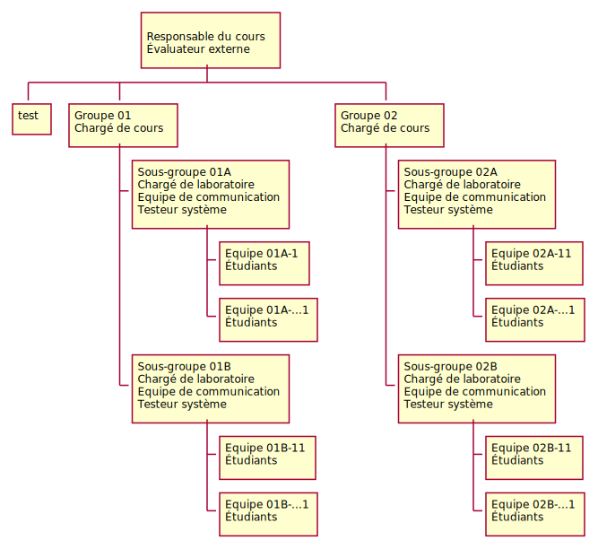

# Le contexte de l'organisation
Vous êtes nouvellement embauché par l'organisation LOG430 pour développer le projet de Ville intelligente.  La réussite de ce projet n'est pas optionnelle. La carrière des étudiants peut grandement être impactée s'ils échouent ce cours. C'est pour cette raison que l'organisation a décidé de séparer les responsabilités selon les parties prenantes suivantes :

## Partie prenantes

### Responsable du cours (client)
- Effectuera l'évaluation du rapport de test système sur le terrain (4 équipes de terrain, 2 équipes par groupe)
- L'évaluation ne doit pas prendre plus de 15 minutes par équipe

### Invité externe (Acheteur potentiel)
- Architecte externe de la ville de Montréal qui effectuera l'évaluation du rapport de test système sur le terrain (4 équipes de terrain)
- L'évaluation ne doit pas prendre plus de 15 minutes par équipe.

### Chargé de cours (client)
- Effectuera l'évaluation du rapport final du test système sur le terrain (4 équipes de terrain, 2 équipes par groupe)
- Veut un rapport permettant de valider les exigences clients

### Chargé de laboratoire (client)
- Effectuera l'évaluation de l'architecture de chaque équipe
- Responsable de répondre aux questions des étudiants
- Responsable d'aider les étudiants à maîtriser les concepts d'architecture
- Veut un rapport détaillé de l'architecture et des interfaces

### Classe
- Chaque classes est séparé en deux sous-groupes distincts

### Sous-groupe
- Chaque sous-groupe est séparé en équipe de 5 étudiants.
- Chaque étudiant est conjointement et solidairement responsable des livrables.¶
- Chaque sous-groupe doit démontrer que son architecture est meilleure que celle des autres sous-groupes. Inclus les sous-groupe de l'autre classe qui sont considérés comme des compétiteurs.

### Équipe (Étudiants)
- Le chargé de cours crée les équipes de laboratoires.
- Un étudiant par équipe est nommé pour faire partie de l'équipe de coordination (bonis de 5% de la note de laboratoire de l'équipe)
- Une équipe peut révoquer son représentant de l'équipe de coordination s'il ne réponds pas à leur attentes 
  - Cet étudiant n'obtiendra pas son bonus de 5% pour la participation à l'équipe de coordination et sera pénalité de 5% sur sa note de laboratoire
- **Doit conserver une traçabilité de quel étudiant est responsable de quelle tâches**
- **Doit connaître en tout temps l'état d'une tâche assignée à un étudiant**
- Ont la responsabilité de concevoir l'architecture permettant de satisfaire aux exigences client
- Ont la responsabilité de concevoir/documenter et diffuser (à l'équipe de coordination) la documentation des interfaces des microservices qui leur ont été assignés.
- Ont la responsabilité d'implémenter les microservices
- Ont la responsabilité de tester leur implémentation
- Ont la responsabilité d'intégrer leur microservices avec les microservices des autres équipes pour obtenir une application permettant de satisfaire aux exigences clients.
- Ont la responsabilité de faire l'intégration de tous les microservices pour réaliser l'application qui satisfait aux exigences client.

### Équipe de coordination (Architectes)
- Cette équipe est responsable de l'architecture globale du système
- Cette équipe a la responsabilité de **valider et de diffuser** la documentation des interfaces touchant aux composants implémentés par plusieurs équipes. Deux changement de version sont autorisés par itération.
  - Une version d'interface publiée ne peut pas être changée. Vous devez obligatoirement publier une nouvelle version.
- L'équipe de coordination peut démettre de ses fonctions un étudiant qui ne répond pas à ses attentes. 
  - Cet étudiant n'obtiendra pas son bonus de 5% pour la participation à cette équipe et sera pénalité de 5% sur sa note de laboratoire
  - L'équipe affecté devra nommer un nouveau représentant
- Les deux équipes de coordination ne doivent pas travailler ensemble ils sont des compétiteurs
- L'Équipe de coordination est aussi responsable de répartir équitablement les tâches de réalisation de la conception et l'implémentation des différents microservices nécessaire à ce projet.
- **Doit conserver une trace écrite pour savoir quelle équipe implémente quel microservice.**
- **Je vous suggère fortement de faire implémenter chaque microservice par au moins 2 équipes pour assurer une certaine disponibilité des microservices durant le laboratoire.**  

### Équipe de testeurs système (Itération #3 seulement)
- Chaque équipe de coordination créera une équipe de testeurs système, parmi les étudiants du sous-groupe, qui aura pour responsabilité de réaliser le test final sur le terrain pour comparer en temps réel les données de Google Map, Waze, etc... et une configuration du sous-groupe. (Chaque membre reçoit un bonis de 2% de la note de laboratoire de l'équipe)
- Aucun membre de l'équipe de coordination ne peut faire partie de l'équipe testeurs système
- L'équipe de test système peut démettre de ses fonctions un membre qui ne répond pas à ces attentes (perte du bonis et pénalité de 2% de la note de laboratoire de l'équipe)
 - Documentation du processus de test système sur le terrain
 - Expérimentation réelle et documentation des résultats
